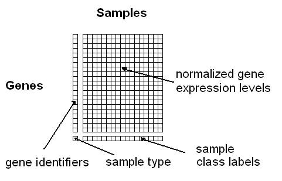
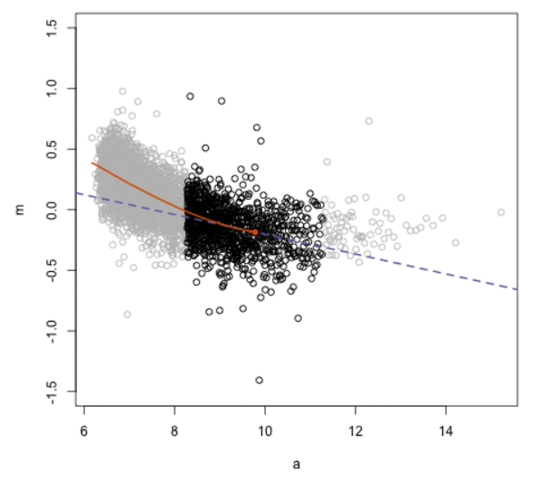

```{r setup, echo=FALSE, message=FALSE, warning=FALSE}
# Set up the environment
library(knitr)
opts_chunk$set(cache.path='cache/', fig.path='img/', cache=F, tidy=T, fig.keep='high', echo=F, dpi=100, warnings=F, message=F, comment=NA, warning=F, results='as.is', fig.width = 10, fig.height = 6) #out.width=700, 
library(pander)
panderOptions('table.split.table', Inf)
set.seed(1)
library(dplyr)
options(stringsAsFactors = FALSE)
library(ggplot2)
library(cowplot)
library(gridExtra)
```

## Bland–Altman plot

- A method of data **plotting** to **analyze agreement** between **two** sets of measures.
- Popularized by J. Martin Bland and Douglas G. Altman after a 1981 short publication by Staffan Eksborg.
- Also known as "Tukey mean-difference plot."

\tiny Altman DG, Bland JM (1983). "Measurement in medicine: the analysis of method comparison studies." The Statistician. 32: 307–317. doi:10.2307/2987937.
 
Bland JM, Altman DG (1986). "Statistical methods for assessing agreement between two methods of clinical measurement." Lancet. 327 (8476): 307–10. doi:10.1016/S0140-6736(86)90837-8. - Cited >42,000 times

## Measure of agreement

- How to assess the degree of agreement between two measures?
- Case scenario: 
    - Temperature measures over 15 days by a mercury-in-glass and an alcohol thermometer. 
    - How similar are measures from the two thermometers?

```{r}
mtx <- data.frame(Therm1 = c(1, 5, 10, 20, 50, 40, 50, 60, 70, 80, 90, 100, 150, 200, 250, 300, 350, 400, 450, 500, 550, 600, 650, 700, 750, 800, 850, 900, 950, 1000),
                  Therm2 = c(8, 16, 31, 25, 38, 55, 41, 69, 73, 63, 123, 81, 182, 258, 276, 381, 321, 435, 478, 588, 627, 649, 739, 767, 794, 852, 872, 958, 1002, 961))
rownames(mtx) <- paste("d", seq(1:nrow(mtx)), sep = "")
mtx_to_plot <- t(mtx[1:15, ]) %>% as.data.frame()
mtx_to_plot
```

## Measure of agreement

- How to assess the degree of agreement between two measures?
- Case scenario: 
    - Expression of 15 genes is measured by two types of microarrays, Affymetrix and Illumina. 
    - How similar are measures from the two arrays?

```{r}
mtx <- data.frame(Array1 = c(1, 5, 10, 20, 50, 40, 50, 60, 70, 80, 90, 100, 150, 200, 250, 300, 350, 400, 450, 500, 550, 600, 650, 700, 750, 800, 850, 900, 950, 1000),
                  Array2 = c(8, 16, 31, 25, 38, 55, 41, 69, 73, 63, 123, 81, 182, 258, 276, 381, 321, 435, 478, 588, 627, 649, 739, 767, 794, 852, 872, 958, 1002, 961))
rownames(mtx) <- paste("g", seq(1:nrow(mtx)), sep = "")
mtx_to_plot <- t(mtx[1:15, ]) %>% as.data.frame()
mtx_to_plot
# Append difference and average columns
mtx <- data.frame(mtx, Difference = mtx$Array1 - mtx$Array2, Average = rowMeans(mtx[, c("Array1", "Array2")]))
```

## Measure of agreement

- How to assess the degree of agreement between two measures?
    - **Pearson or product-moment correlation** - whether, and how strongly, pairs of variables are related. $r$ - the ratio of covariance between the variables to the product of their standard deviations.
    - **Linear regression** - finds the best line that predicts one variable from the other. $r^2$ - the coefficient of determination, the proportion of variance that the two variables have in common.
- The correlation coefficient and regression technique can be misleading when assessing agreement because they evaluate only the linear association of two sets of observations. 

\tiny Udovicic M, Bazdaric K, Bilic-Zulle L, Petrovecki M. What we need to know when calculating the coefficient of correlation? Biochem Med (Zagreb) 2007;17:10-5. http://dx.doi.org/10.11613/BM.2007.002.

## Measure of agreement

```{r}
# Correlation between two assays
corr <- cor(mtx$Array1, mtx$Array2)
# Regression between two assays
fit <- lm(Array1 ~ Array2, mtx)
# Plot the results
ggplot(mtx, aes(x = Array2, y = Array1)) +
  geom_point(size = 2) +
  geom_smooth(method=lm, se=FALSE) +
  annotate("text", x = 200, y = 800, label = paste0("Pearson correlation coefficient: ", round(corr, digits = 3)), size = 5) +
  annotate("text", x = 100, y = 700, label = paste0("y = ", round(coef(fit)[1], digits = 2), " + ", round(coef(fit)[2], digits = 2), "x"), size = 5) +
  annotate("text", x = 118, y = 600, label = paste0("Adj r-squared: ", round(summary(fit)$adj.r.squared, digits = 3)), size = 5)
```

## Bland-Altman plot for measuring agreement

- Plot every **difference** between two pairs of the measurements against the **average** of the measurement.

```{r fig.height=5}
mtx[1:10, ]
```

## Bland-Altman plot for measuring agreement

- Allows investigation of the relationship between measurement error and the true value (assumed to be the mean).

```{r fig.height=5}
a <- ggplot(mtx, aes(x = Average, y = Difference)) +
  geom_point(size = 2) +
  geom_hline(yintercept = mean(mean(mtx$Difference)), linetype = "dashed", size = 1) +
  xlab("Average = (Array1 + Array2) / 2") +
  ylab("Difference = Array1 - Array2")

# b <- ggplot(mtx, aes(Difference)) +
#   geom_density(alpha = 0.5) +
#   xlab("") +
#   theme(axis.title.x = element_text(colour = "white"), axis.text.x = element_text(colour = "white")) + 
#   coord_flip()
# 
# grid.arrange(a, b, ncol = 2, widths = c(4, 1))
print(a)
```

## Bland-Altman plot for measuring agreement

- Measure agreement as the proportion of the differences within _a priori_ defined limits (e.g., $\pm 1.96SD$ of the differences around the mean)

```{r fig.height=5}
ggplot(mtx, aes(x = Average, y = Difference)) +
  geom_point(size = 2) +
  geom_hline(yintercept = mean(mean(mtx$Difference)), linetype = "dashed", size = 1) +
  geom_hline(yintercept = mean(mean(mtx$Difference)) + 1.96 * sd(mtx$Difference), linetype = "dashed") +
  geom_hline(yintercept = mean(mean(mtx$Difference)) - 1.96 * sd(mtx$Difference), linetype = "dashed")
```

## Bland-Altman plot for data normalization

- It is expected that measures from the two assays would be identical, or very similar.
- The difference between each pair of measures should be near zero.
- On the Bland-Altman plot, the differences should form a cloud around zero line.
    - Any deviation from the zero line indicates that one assay consistently over- or underestimates the measures.

## Bland-Altman plot for data normalization

```{r}
ggplot(mtx, aes(x = Average, y = Difference)) +
  geom_point(size = 2) +
  geom_hline(yintercept = mean(mean(mtx$Difference)), linetype = "dashed", size = 1) +
  geom_hline(yintercept = 0, colour = "black", linetype = "solid", size = 1)
```

## Bland-Altman plot for data normalization

```{r}
ggplot(mtx, aes(x = Average, y = Difference)) +
  geom_point(size = 2) +
  geom_hline(yintercept = mean(mean(mtx$Difference)), linetype = "dashed", size = 1) +
  geom_hline(yintercept = 0, colour = "black", linetype = "solid", size = 1) +
  geom_smooth(method = "lm", se = FALSE, colour = "red")
```

## Bland-Altman plot for data normalization

```{r}
ggplot(mtx, aes(x = Average, y = Difference)) +
  geom_point(size = 2) +
  geom_hline(yintercept = mean(mean(mtx$Difference)), linetype = "dashed", size = 1) +
  geom_hline(yintercept = 0, colour = "black", linetype = "solid", size = 1) +
  stat_smooth(method = "lm", formula = y ~ x + I(x^2), se = FALSE, colour = "red")
```

## Bland-Altman plot for data normalization

- When the two measures differ in some systematic way, we see deviations from $Difference = 0$.
- We don't know which measure is correct; hence, the goal is to adjust each measure in such a way that the differences between them become minimal (centered around $Difference = 0$).
    - Fit a curve through the Bland-Altman plot, $L$ are the fitted values of the curve.
    - Subtract half of the fit from measures for Assay 1 and add half of the fit to measures for Assay 2.
        - $Array1 = Array1 - L/2$
        - $Array2 = Array2 + L/2$
    - Recalculate Difference and Average using the adjusted measures.
    - Plot them on the Bland-Altman plot.

## Bland-Altman plot for data normalization

```{r}
# Make a fit
fit <- lm(mtx$Difference ~ mtx$Average + I(mtx$Average^2))
# Subtract/add
mtx$Array1.1 <- mtx$Array1 - fit$fitted.values/2
mtx$Array2.1 <- mtx$Array2 + fit$fitted.values/2
# Recalculate Difference and Average
mtx$Average2 <- (mtx$Array1.1 + mtx$Array2.1)/2
mtx$Difference2 <- mtx$Array1.1 - mtx$Array2.1

ggplot(mtx, aes(x = Average2, y = Difference2)) +
  geom_point(size = 2) +
  geom_hline(yintercept = mean(mean(mtx$Difference2)), linetype = "dashed", size = 1) +
  geom_hline(yintercept = 0, colour = "black", linetype = "solid", size = 1)
```

<!-- - Start with gene expression/microarrays, describe MA plot. -->
<!-- - Premise for normalization - the majority of the genes do not change their expression (Difference = 0) and can be used as a common reference to normalize the data. -->
<!-- - Describe Loess regression that we use to normalize the data because we don't know a priori which biases are present. -->
<!-- - Mention Cyclic Loess. -->
<!-- - Mention limma, edgeR, DESeq R packages that use MA plot and Loess regression to normalize the data. -->
<!-- - Introduce Hi-C data matrices, the off-diagonal thinking as view of the distance. -->
<!-- - Mention that MA plot has been applied to normalization of Hi-C data. -->
<!-- - Describe our idea of using distance stratum instead of average. -->
<!-- - Mention HiCcompare and multiHiCcompare R packages. -->
<!-- - Show a snapshod of article we reviewed showing multiHiCcompare is best. -->
<!-- - Conclude that Bland-Altman plot is a simple and versatile tool for data exploration and normalization -->

# Scaling up the Bland-Altman plot

## Adaptation of the Bland-Altman plot for omics data

- The Bland-Altman plot has become commonly used in omics data
- Typically it is used in the form of an MA plot (Minus vs. Average plot)
- MA plots are on the log scale 
- $M = log(X) - log(Y) = log(X/Y)$
- $A = \frac{1}{2}log(X) + \frac{1}{2}log(Y) = \frac{1}{2}log(XY)$

<!-- ## Microarray and gene expression data -->

<!-- - Microarrays are used to measure the expression of DNA -->
<!-- - Microarrays are represented by a matrix where each row is a genomic feature and columns are samples  -->
<!-- - An entry in the gene expression matrix represents an expression level for the corresponding gene -->
<!-- - MA plots can be used to check for bias and normalize gene expression -->


<!-- ## Microarrays -->

<!--  -->

<!-- ## Sequencing data -->

<!-- - Measured from RNA-seq and other high-throughput data are also summarized into matrices of counts.  -->
<!-- - Similarly, these genomic data types also suffer from biases and require normalization. -->
<!-- - MA plots are commonly used to visualize and normalize these data types. -->

## Normalizing omics data

- It is assumed that the majority of genes (or genomic features) do not change expression between samples; thus, the average difference between samples should be 0.
- Average gene expression can be used as a common reference for normalization on the MA plot
- The logarithmic scale is important in genomics data due to a large range of possible values in the data

## Loess normalization on the MA plot

- Loess - locally estimated scatterplot smoothing.
- A form of local regression where only a subset of the data is used to fit a curve - **non-parametric**, **data-driven**.
- Loess is the most common method of fitting a model to an MA plot for normalization.
- Allows for the removal of between sample biases.

\tiny William S. Cleveland, Robust Locally Weighted Regression and Smoothing Scatterplots. Journal of the American Statistical Association Vol. 74, No. 368 (Dec., 1979). DOI: 10.2307/2286407

## Loess 



- `loess()`, `fANCOVA::loess.as()`

## Steps of loess normalization

- Calculate M and A for the two datasets to be compared.
- Fit loess curve to MA plot.
- $log(X_N) = log(X) - L/2$
- $log(Y_N) = log(Y) + L/2$
- $L$ are the fitted values of the loess curve, $X_N$, $Y_N$ are the normalized values for the two datasets.

## Example Normalization

```{r, results='hide'}
library(affydata)
data(Dilution)
```


```{r}
dat <- Dilution@assayData$exprs[1:5000,]
ex1 <- data.frame(M = log(dat[,1]/dat[,2]), A = (1/2)*log(dat[,1]*dat[,2]))

p1 <- ggplot(ex1, aes(x = A, y = M)) +
  geom_point(size = 2) +
  geom_hline(yintercept = 0) +
  stat_smooth(method = "loess", formula = y ~ x, se = FALSE) 

fit <- loess(ex1$M ~ ex1$A)
x <- log(dat[,1]) - fit$fitted/2
y <- log(dat[,2]) + fit$fitted/2
ex2 <- data.frame(M = x-y, A = (1/2)*x + (1/2)*y)

p2 <- ggplot(ex2, aes(x = A, y = M)) +
  geom_point(size = 2) +
  geom_hline(yintercept = 0) +
  stat_smooth(method = "loess", formula = y ~ x, se = FALSE) 

grid.arrange(p1, p2, ncol = 2)
```

## Cyclic loess

When there are more than 2 samples to normalize cyclic loess can be used

1. Choose two out of the $N$ total samples then generate an MA plot.
2. Fit a loess curve $f(x)$ to the MA plot.
3. Subtract $f(x)/2$ from the first dataset and add $f(x)/2$ to the second.
4. Repeat until all unique pairs have been compared.
5. Repeat until convergence.

## Packages

- Several R packages have support for MA plotting and normalization of genomics data
- `limma`, `edgeR`, `DESeq2`
- Built-in functions for plotting and normalizing RNA-seq and microarray data

&nbsp;

&nbsp;

&nbsp;

\tiny http://bioconductor.org/packages/limma/

http://bioconductor.org/packages/edgeR/

https://github.com/mikelove/DESeq2

## Hi-C data

- Hi-C data is a sequencing technique that captures the 3D structure of the DNA.
- Symmetric matrix with values indicating the strength of interaction between two regions

## Hi-C data

\begin{center}
\includegraphics[height=210px]{matrix.png}
\end{center}

## Hi-C data

\begin{center}
\includegraphics[height=180px]{hi_c_distance_centric.png}
\end{center}

- MA normalization has been applied to Hi-C data
- Our work proposed a modification of MA normalization

## Our modification: MD plot

- Minus vs. Distance (MD) plot.
- Used for normalizing Hi-C data in the `HiCcompare` and `multiHiCcompare` R packages.
- Unit distance (D) between interacting genomic regions is used instead of A.
- This is better suited to the distance-centric nature of Hi-C data.

&nbsp;

&nbsp;

&nbsp;

\tiny http://bioconductor.org/packages/HiCcompare/

http://bioconductor.org/packages/multiHiCcompare/

## MD plot example

```{r}
library(HiCcompare)
data("HMEC.chr22")
data("NHEK.chr22")
hic.table <- create.hic.table(HMEC.chr22, NHEK.chr22, chr= 'chr22')
# Plug hic.table into hic_loess()
result <- hic_loess(hic.table, Plot = TRUE, Plot.smooth = FALSE)
```


## multiHiCcompare

\begin{center}
\includegraphics[height=140px]{multiHiCcompare.png}
\end{center}

- Normalization utilizes cyclic loess on the MD plot.
- Accepted for publication in _Bioinformatics_ journal.

&nbsp;

\tiny DOI: 10.1093/bioinformatics/btz048 (in press)

## Summary: Application of Bland-Altman plot

- Used to measure the agreement of a new measure with a gold standard.
- Compare two measures/check reproducibility.
- Remove bias (normalize) datasets in a data-driven manner.

&nbsp;

&nbsp;

&nbsp;

\tiny Giavarina, Davide. “Understanding Bland Altman Analysis.” Biochemia Medica 25, no. 2 (2015): 141–51. https://doi.org/10.11613/BM.2015.015.

## Thank you

\begin{center}
\large Questions?
\end{center}

&nbsp;

&nbsp;

&nbsp;

&nbsp;

&nbsp;

\small https://github.com/jstansfield0/Talk_Biostats_Grand_Rounds_2019

